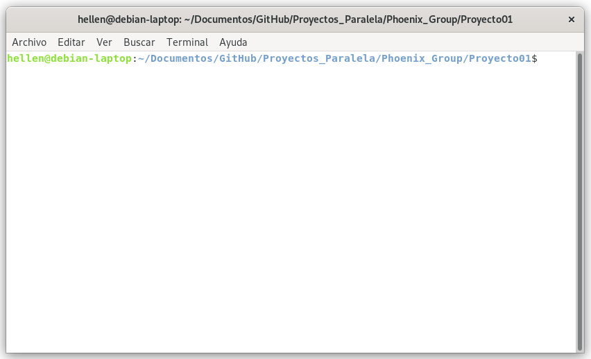
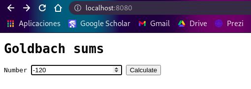
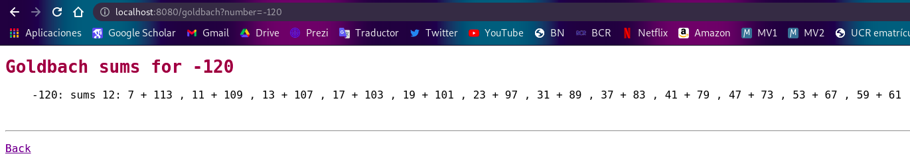
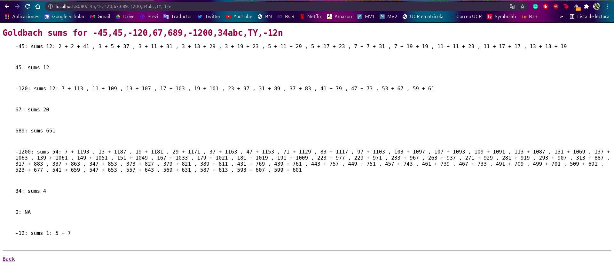

# Universidad de Costa Rica

## Goldbach WebServer

## Segunda fase

### Versión 2.0

Este proyecto se basa en utilizar un servidor web concurrente, el cual puede recibir multiples conexiones de usuarios. El mismo recibe uno o varios números ingresados por el usuario, vía una consulta HTTP. Los procesa y devuelve, mediante una respuesta HTTP, el resultado pertinente para cada número como una lista de las sumas calculadas, por medio de una inyección a HTML.

## Conjetura Goldbach

La conjetura de Goldbach dice lo siguiente

Todo número entero mayor que 5:

- Si es par se puede escribir como suma de dos números primos (conjetura fuerte). Por ejemplo: 6=3+3, 8=3+5, 14=3+11=7+7.

- Si es impar se puede escribir como suma de tres números primos (conjetura débil). Por ejemplo.: 7=2+2+3, 9=2+2+5, 9=3+3+3.

Para efectos de este proyecto, cuando un número es mayor que 5, se muestra la cantidad de sumas. Cuando es menor que -5, muestra la cantidad de sumas y las sumas que lo conforman. Asimismo, si esta entre -5 y 5, imprime N/A.

## Servidor Web

El Servidor Web es fundamental para la correcta funcionalidad del proyecto. Al iniciar, el servidor web, este recibe por parámetro un valor que se refiere al número máximo de conexiones de cliente que el servidor web debe permitir de manera concurrente. En cada conexión, el servidor web debe ser capaz de procesar las solicitudes que tenga el usuario para la aplicación web. Asimismo, el servidor utiliza un hilo por consulta (HTTP), haciendo que varios usuarios puedan ser atentidos de forma simultánea, y enviar una respuesta (HTTP) a lo solicitado. 

Cada consulta realizada, se encarga de enviar los números de cada solicitud a una calculadora de Goldbach, espera a que esta haga los cálculos de las sumas para el/los números que recibe, y después inyecta los resultados mediante HTML para que el usuario pueda visualizar los resultados.


## Calculadora Goldbach

Tomando en cuenta la conjetura fuerte y la conjetura débil mencionadas anteriormente, la aplicación de calculadora Goldbach, recibe el o los números ingresados por el usuario y hace los cálculos que se mencionan en el apartado de explicación de la conjetura. Es decir, si el número es par va a calcular sumas de dos dígitos conformadas por números primos. Y si es impar, va a calcular sumas de 3 dígitos conformadas por números primos. La misma va a guardar en una lista los dígitos que conforman las sumas de los números negativos menores que 5, tanto para una conjetura débil o una fuerte.

Cabe mencionar que, el proceso para calcular estas sumas requiere de una gran cantidad de capacidad de procesamiento, por lo que, la cantidad de hilos que se crearan para realizar este proceso, es igual a la cantidad de núcleos que posee la máquina a menos que se indique una cantidad diferente a la hora de la ejecución del programa.

## Usabilidad

Para usar el programa de deben seguir los siguientes pasos.

1. Abrir la terminal y ubicarse dentro de la carpeta ```/Proyecto01```.



2. Compilar escribiendo ```make``` y presionar enter.


3. Abrir una terminal dentro de la carpeta ```/bin``` que se crea dentro de ```/Proyecto01``` al compilar.


4. Escribir ```./nombreEjecutable``` o ```./nombreEjecutable númeroPuerto cantidadHilos```, para ejecutar la aplicación.


5. Abrir en el navegador, un local host con el puerto indicado al ejecutar el programa. De la forma ```localhost:númeroPuerto```.


6. Para consultar un solo número, el mismo deberá ser agregados en el formulario que se muestra en pantalla y presionar el botón ```"Calculate"```




7. Si se desea consultar más de un solo número, se debe utilizar el url del sitio. Los números a consultar deberán ser agregados en el url después de *localhost:númeroPuerto/*, donde cada número debe de ser ingresado como una lista, cada número mediando por una coma, al terminar, presionar enter. Se realiza de la siguiente forma. ```localhost:númeroPuerto/n1,n2,n3,...,n```. Por ejemplo: ```localhost:8080/-18,54,12,-222```.


8. Seguido se calculan y se muestran los resultados de la conjetura. 






## Autores

Jean Quesada Abarca, B93082\
Andrés Zamora Víquez, B17364\
Hellen Fuentes Artavia, B93082