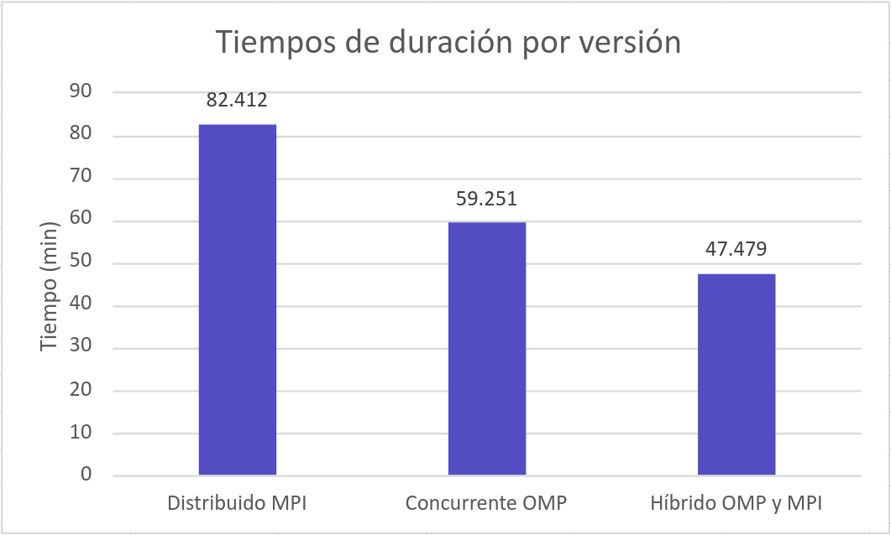

# Universidad de Costa Rica
## Bosque Encantado Paralelo
## Segunda fase
### Versión 2.0

## Análisis de rendimiento

Después de desarrollar el programa concurrente, distribuido e híbrido, se obtienen los tiempos de duración de cada uno, con el objetivo de poder calcular el incremento de velocidad y eficiencia con cada uno de ellos.

Cada uno de los programas se probaron con el job002.txt. Donde para cada uno de ellos se obtuvo el tiempo de duración en **minutos** y se calcula el speedup y eficiencia. Los resultados obtenidos se pueden observar en la siguiente tabla. En la misma se pueden ver los datos obtenidos para la versión concurrente OpenMP en un solo nodo, distribuida MPI 24 procesos e híbrida OpenMP + MPI tres procesos y ocho hilos. 

A partir de estos resultados, se realizan 2 gráficos de líneas y 1 de barras para representar estos resultados de forma más visual y lograr determinar el rendimiento de cada versión.

Como se puede visualizar, en la figura 1, el speedup de la versión distribuida, fue de 1.35538. Mientras que la concurrente con OMP es de 1.8852 y el híbrido de 2.35261. Por lo que se puede evidenciar que, la versión híbrida es la que obtiene el mejor incremento de velocidad.

En la figura 2, se muestra la eficiencia obtenida a partir de los tiempos de duración de cada versión, sin embargo, solo se toman en cuenta las versiones consurrente OMP e híbrida, debdio a que la distribuida MPI solo tiene un trabajador. A partir de estos datos, se puede visualizar que la versión híbrida obtiene la mayor eficiencia. 

Por último, en la figura 3, se realiza una comparación entre los tiempos de duración de cada versión, donde se obtiene el mejor tiempo en la versión híbrida, lo cual afirma que en conjunto con los datos de dpeedup y eficiencia, nos da el mejor rendimiendo para el procesamiento a realizar en el programa.

Para concluir, los resultados arrojaron la versión híbrida cumple con el rendimiento esperado, pues al realizar sus procesos de forma distribuida y concurrente, va a aumentar su eficiencia en un menor tiempo.
