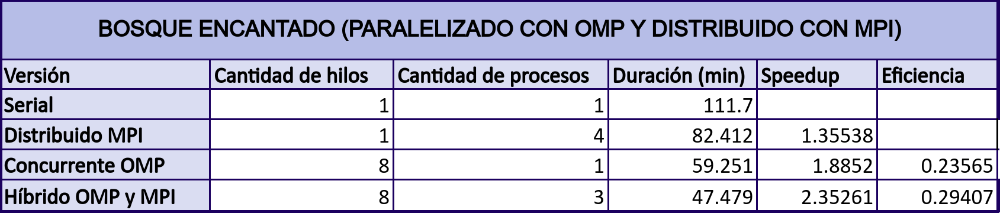
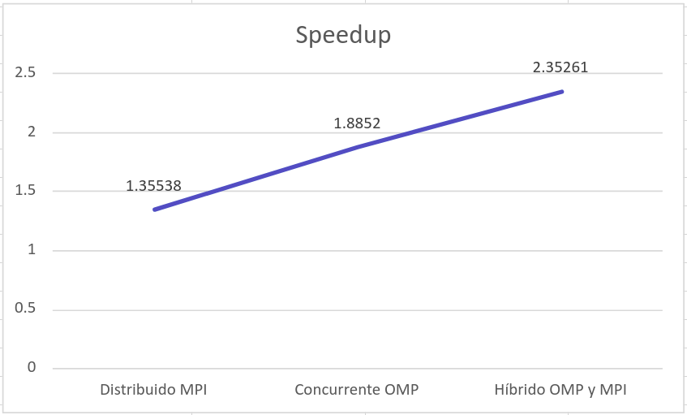

# Universidad de Costa Rica
## Bosque Encantado Paralelo
## Primera fase
### Versión 1.0
## Análisis de rendimiento
De forma inicial se decidió realizar un mapeo dinámico para llevar a cabo el proceso correspondiente para la creación de matrices, proceso de cada medianoche y escritura de outputs, pues nos pareció la mejor forma de dividir el trabajo por su naturaleza dinámica.
Por otro lado, para realizar la elección definitiva del tipo de mapeo a realizar, se realizó un mapeo en bloque, cíclico, dinámico y guiado para obtener los tiempos de duración de cada uno y poder calcular el incremento de velocidad y eficiencia con cada uno de ellos. 
Cada uno de los mapeos se probaron con el job002.txt. Donde para cada uno de ellos se obtuvo el tiempo de duración en minutos, speedup y eficiencia. Los resultados obtenidos se pueden observar en la siguiente tabla.

A partir de estos resultados, se realizan tres gráficos de barras para representar estos resultados de forma más visual y lograr determinar el mapeo óptimo para el desarrollo de la aplicación.

Como se puede visualizar, en la figura 1,  la duración en minutos del programa serial, fue de 111,70. El mismo lo vamos a comparar con los tiempos de duración de los mapeos dinámico, guiado y en bloque. La duración del mapeo dinámico, fue de aproximadamente un 60% menos que el serial, presentando una gran mejoría en el tiempo de ejecución del programa. Sin embargo, hubo una mejoría al utilizar el mapeo guiado con respecto al dinámico, pues, el mismo dura 0.72 minutos menos que el dinámico. No obstante, aunque hubo una mejoría, el mejor tiempo de duración se obtuvo con el mapeo en bloque, el cual dura 4.97 minutos menos que el dinámico.

En la figura 2, obtenemos los resultados del speedup, que como fue de esperarse por los tiempos de duración ya discutidos, el mapeo en bloque es el que obtiene el mejor incremento de velocidad. 

Por último, en la figura 3, se muestra la eficiencia obtenida a partir de los tiempos de duración de cada mapeo, donde el mapeo por bloque obtiene la mayor eficiencia.
Para concluir, los resultados arrojaron que el mapeo elegido inicialmente(dinámico), no es el indicado para llevar a cabo el proceso requerido para la concurrencia del programa. Por lo que, se hizo un cambio de un mapeo dinámico a un mapeo en bloque para una mayor optimización del programa.
