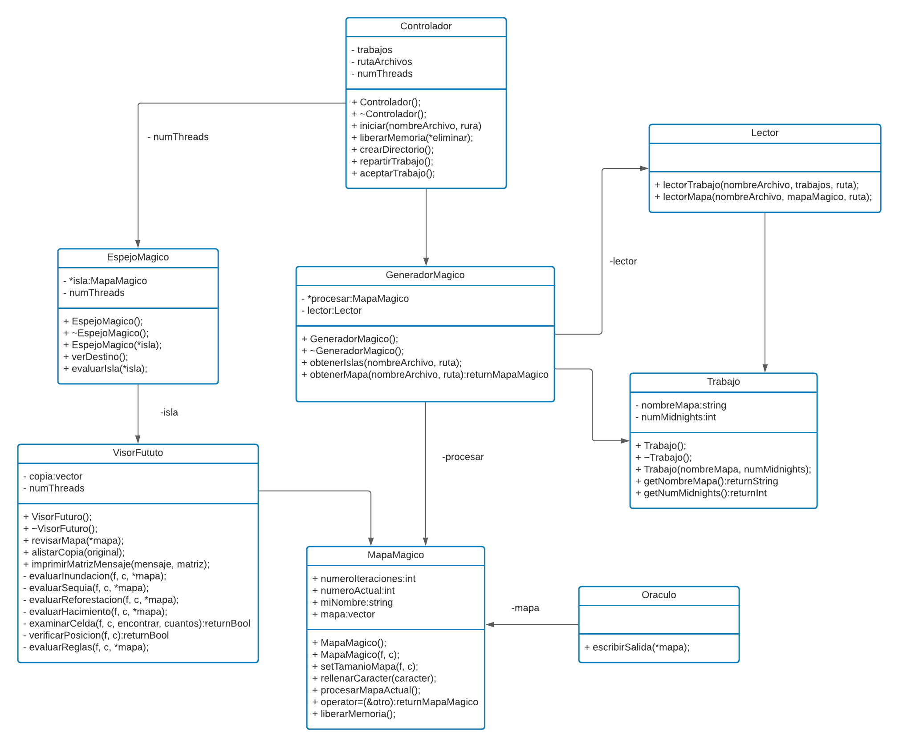

# Universidad de Costa Rica
## Bosque Encantado Serial
## Primera fase
### Versión 1.0
## Diagramas y algoritmos
En este documento se hace la discusión sobre el diagrama UML implementado y algoritmos realizados para explicar la funcionalidad del programa.

### Algoritmos
El siguiente pseudocódigo corresponde al método de iniciar de la clase controlador. La cual se encarga de inicializar el programa y controlar el proceso a realizar.

```
iniciar(nombre, ruta, numThreads):
    vector<Trabajo> trabajos;
    Generador::obtenerIslas(nombre,ruta,trabajos,numThreads);
    crearDirectorio();
    if (MPI_Init() == MPI_SUCCESS) {
        int my_rank = MPI_Comm_rank();
        if (my_rank == 0){ 
          repartirTrabajo();
          }
        else{ 
          aceptarTrabajo();
          }
        MPI_Finalize();
      }
```
Mediante el método crearDirectorio, se crea un directorio donde serán almacenados los outputs del programa. Por lo que, para iniciar el programa, se crea el directorio y se reciben los trabajos y mapas dentro de él. El trabajo es almacenado en un vector de trabajo que contiene los nombres de los archivos de texto con los mapas y la cantidad de mediasnoches a procesar. Asimismo, se inicializa el MPI, mediante MPI_Init(). Después de eso, si es el proceso 0, reparte los trabajos (productor), de otra forma, pide por trabajos (consumidor). Posterior, se finaliza el MPI mediante MPI_Finalize().

Después de eso, cada mapa guardado en el vector de trabajo se extrae y se crea una matriz en MapaMagico con las dimensiones del mapa y su contenido. Por último, llama al método encargado de procesar cada mapa. Después de realizar el proceso libera la memoria alojada para cada mapa.

### Diseño UML

En el siguiente diagrama de clases, se muestra la interacción entre las clases desarrolladas en el proyecto.



Como se puede observar en el diseño, de forma más gráfica, el controlador es el encargado de iniciar el programa y los procesos necesarios para llevar a cabo el transcurso del mismo. Asimismo, se puede visualizar el flujo de toda la aplicación. Asimismo, es importante mencionar que, la clase Oraculo es la encargada de escribir las salidas en el directorio ya mencionado en el punto anterior, la cual se crea en el controlador.

## Autores

Jean Quesada Abarca, B93082\
Andrés Zamora Víquez, B17364\
Hellen Fuentes Artavia, B93082
