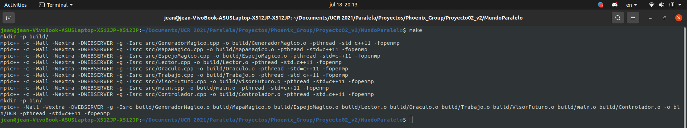
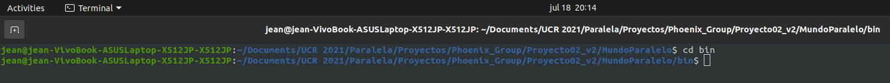
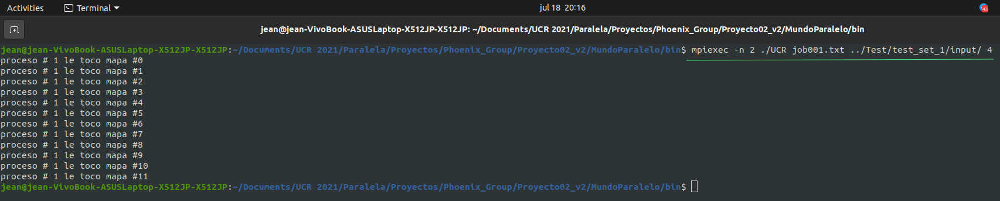

# Universidad de Costa Rica
## Bosque Encantado Paralelo
## Segunda fase
### Versión 2.0

## Descripción del problema

Un rey generoso de una isla muy lejana, estaba preocupado porque sus ciudadanos estaban aburridos de la monotonía de la pequeña isla. Tuvo la idea de encantar el bosque que está alrededor de su castillo, de tal forma que cada medianoche el bosque cambie y al día siguiente los ciudadanos encuentren un lugar diferente para recrearse. A su mago le pareció genial la idea, pero no sabe qué reglas incluir en el hechizo para que el bosque se mantenga en equilibrio y no llegue a convertirse en un desierto o una selva impenetrable. Si tuvieran alguna forma de ver el efecto de las reglas a futuro, podrían decidir el hechizo con mayor seguridad.
 
El rey tiene un mapa del bosque. El mapa ilustra lo que hay en cada metro cuadrado de la isla (celdas). Una celda puede contener un árbol mágico ( a ), un trozo de lago encantado ( l ), o una pradera ( - ).
 
Las reglas para cambiar el bosque cada medianoche, son las siguientes.
 
1. Inundación: Si la celda tiene un árbol y al menos 4 vecinos que son lago encantado, entonces el lago ahoga el árbol, y pasa a ser lago encantado.
2. Sequía: Si la celda es lago encantado y tiene menos de 3 vecinos que sean lago encantado, entonces el lago se seca y pasa a ser pradera.
3. Reforestación: Si la celda es pradera y tiene al menos 3 vecinos árboles, las semillas tendrán espacio para crecer y la celda se convierte en árbol. 
4. Hacinamiento: Si la celda es un árbol y tiene más de 4 vecinos árbol, el exceso de sombra evita que crezca y entonces pasa a ser pradera.
5. Estabilidad: Cualquier otra situación, la celda permanece como está.
 
Se quiere que el programa ayude a probar las reglas mágicas anteriores en varios mapas. El programa recibe una orden de trabajo que el mago quiere probar. La orden de trabajo es un archivo cuyo nombre se envía por argumento de línea de comandos. En su contenido, la orden de trabajo lista algunos mapas iniciales de la isla, seguida de un número que indica la cantidad de medianoches en las que quiere probarse el efecto de las reglas del potencial hechizo.
 
## Usabilidad
 Para usar el programa se deben seguir los siguientes pasos.
1. Ubicarse dentro de la carpeta ```/Proyecto02_v2```.
2. Entrar en la carpeta ```/MundoParalelo``` y abrir una terminal en esa ruta.
3. Compilar escribiendo ```make``` en la terminal y presionar enter.



4. Abrir una terminal dentro de la carpeta ```/bin```, la cual se crea al compilar dentro de la carpeta ```/MundoParalelo```.



5. Para la ejecución del programa escribir ```mpiexec -n cantidadProcesos ./nombreEjecutable nombreJob.txt rutaJob/ cantidadHilos```, es importante mencionar que la ruta donde se encuentre el trabajo, debe de ser la misma ruta donde se encuentren los mapas. Asimismo, la cantidad de procesos mínima debe de ser 2, de otra forma solo se ejecuta el proceso que recibe el trabajo, pero no se realiza el trabajo.



6. Seguido, se realiza el proceso correspondiente al trabajo que se desea probar y se genera una carpeta llamada ```“Salidas”``` dentro de ```/MundoParalelo```. En esta carpeta se encontrarán los outputs del trabajo introducido por el usuario, un archivo por mapa procesado.
 
## Autores
Jean Quesada Abarca, B96111\
Hellen Fuentes Artavia, B93082\
Andrés Zamora Víquez, B17364
